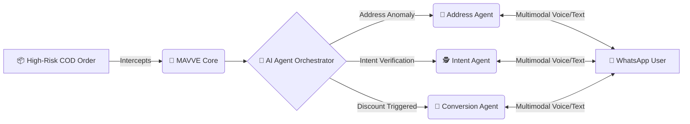

<div align="center">
  <h1>🚀 MAVVE</h1>
  <p><b>Multimodal AI Voice Verification Engine</b></p>
  <p><i>An advanced, automated Return-to-Origin (RTO) reduction platform designed for Indian e-commerce scale.</i></p>

  <p>
    
    
    
    
    
  </p>
</div>

---

## 📖 Table of Contents
- [About MAVVE](#-about-mavve)
- [Architecture](#-architecture)
- [Key Features](#-key-features)
- [Tech Stack](#-tech-stack)
- [Getting Started](#-getting-started)
  - [Docker Setup (Recommended)](#docker-setup-recommended)
  - [Manual Setup](#manual-setup)
- [Example Usage](#-example-usage)
- [Documentation](#-documentation)

---

## 🎯 About MAVVE

MAVVE intercepts high-risk Cash-on-Delivery (COD) orders and deploys autonomous AI agents via WhatsApp (Text & Voice) to:
- Verify buying intent
- Resolve incomplete or bad addresses
- Dynamically negotiate prepaid conversions using real-time margin discounts

---

## 🏗️ Architecture



---

## ✨ Key Features

- 🛡️ **Real-time RTO Prediction**: Intercepts high-risk COD orders instantly upon placement.
- 🧠 **Autonomous AI Orchestration**: Uses LangGraph to dynamically route conversations between specialized agents:
  - 📍 **Address Agent**: Corrects anomalous rural/urban addresses.
  - 🕵️ **Intent Agent**: Verifies physical availability and genuine buying intent.
  - 💸 **Prepaid Conversion Agent**: Negotiates instant discounts to convert COD to UPI/Prepaid.
- 🗣️ **Multimodal Vernacular Capabilities**: Natively speaks to Bharat users in Hindi, Marathi, Bengali, Tamil, etc., via seamless Bhashini Voice-to-Text-to-Voice pipelines.
- 📊 **Real-Time Analytics Dashboard**: Monitor agent performance, savings, and live transcripts via a sleek, **fully responsive and mobile-friendly** React interface.
- 🧪 **E2E Testing Simulator**: Includes an LLM-powered consumer simulator to load-test conversational flows.

---

## 💻 Tech Stack

- **Backend**: FastAPI, Python, SQLAlchemy, PostgreSQL, Redis
- **Frontend**: React, TailwindCSS, Vite
- **AI/ML**: LangGraph, Gemini 2.0 (via OpenRouter), Bhashini (Voice)
- **Deployment**: Docker, Docker Compose

---

## 🚀 Getting Started

Ensure you have your `GEMINI_API_KEY` (or OpenRouter key) and WhatsApp API credentials ready.

### Docker Setup (Recommended)

1. **Clone the repository:**
   ```bash
   git clone <repository_url>
   cd mavve
   ```

2. **Configure Environment:**
   ```bash
   cp backend/.env.example backend/.env
   # Edit backend/.env and add your API keys
   ```

3. **Boot the stack:**
   ```bash
   docker-compose up --build
   ```

**Services Available At:**
- 🖥️ **Frontend Dashboard**: [http://localhost:5175](http://localhost:5175)
- ⚙️ **Backend API**: [http://localhost:8000](http://localhost:8000)
- 📝 **Swagger Docs**: [http://localhost:8000/docs](http://localhost:8000/docs)
- 🧪 **WhatsApp Mock UI**: [http://localhost:8080](http://localhost:8080) (if simulator is running)

---

### Manual Setup

If you prefer running without Docker, follow these steps:

#### Backend
```bash
cd backend
python -m venv venv
source venv/bin/activate  # On Windows: venv\Scripts\activate
pip install -r requirements.txt
alembic upgrade head
python backend/db/seed.py
uvicorn main:app --reload
```

#### Frontend
```bash
cd frontend
npm install
npm run dev
```

---

## 🕹️ Example Usage

**1. Intercept an Order:**
```bash
curl -X POST http://localhost:8000/api/orders/intercept \
  -H "Content-Type: application/json" \
  -d '{"order_id": "ORD-1029"}'
```

**2. Run the E2E Simulator:**
```bash
python -m simulator.run_demo
```

---

## 📚 Documentation

Detailed architectural and API documentation is available in the `docs/` folder:
- 🏛️ [System Architecture](docs/architecture.md)
- 🔌 [API Reference](docs/api_reference.md)
- 🚢 [Deployment Guide](docs/deployment.md)

---
<div align="center">
  <i>Built with ❤️ for Indian E-Commerce Scale</i>
</div>
