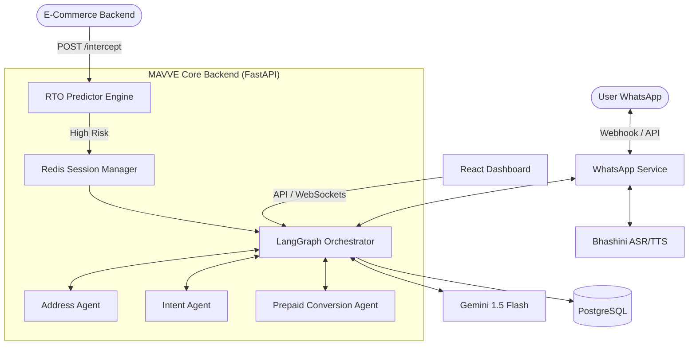
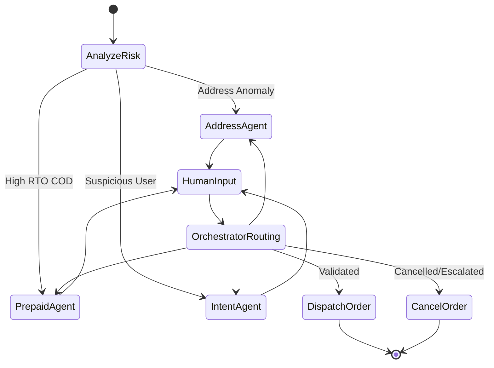

# MAVVE Architecture

MAVVE is composed of a FastAPI backend, a React frontend, and a PostgreSQL/Redis data tier. At its core, it leverages **LangGraph** for deterministic state-machine agent orchestration and **Bhashini** for multimodal vernacular translation.

## System Overview

## LangGraph State Machine

MAVVE uses a directed cyclic graph to handle multi-turn conversations. The `Orchestrator` node determines which specialized agent should respond based on the detected risk factors.

## Bhashini Multimodal Pipeline

When a user sends a Voice Note in a vernacular language (e.g., Hindi, Marathi), MAVVE executes the following chain:

1. **ASR (Speech to Text)**: Bhashini converts Vernacular Audio ➡️ Vernacular Text.
2. **NMT (Translation)**: Bhashini translates Vernacular Text ➡️ English Text.
3. **LLM Processing**: Gemini processes the English text and formulates a response.
4. **NMT (Translation)**: Bhashini translates English Reply ➡️ Vernacular Reply.
5. **TTS (Text to Speech)**: Bhashini converts Vernacular Reply ➡️ Vernacular Audio.
6. Audio is dispatched to the user via WhatsApp.
